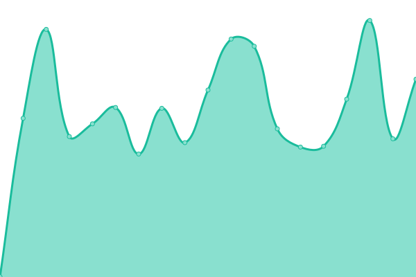
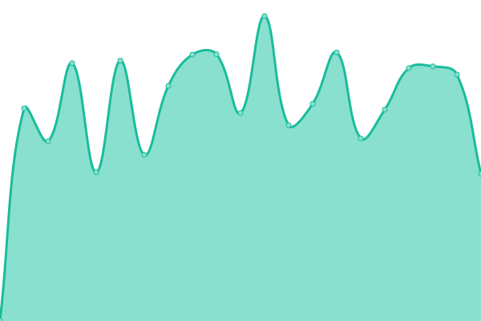
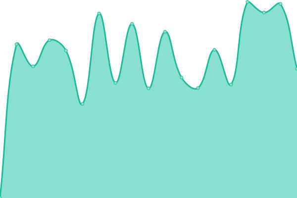
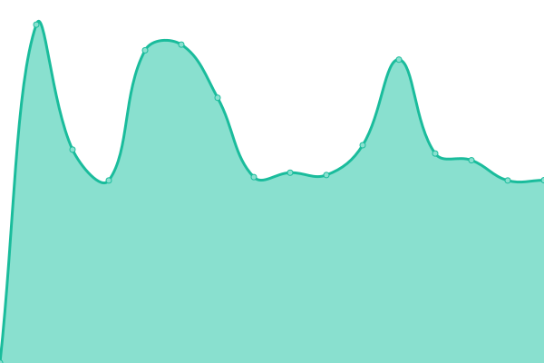
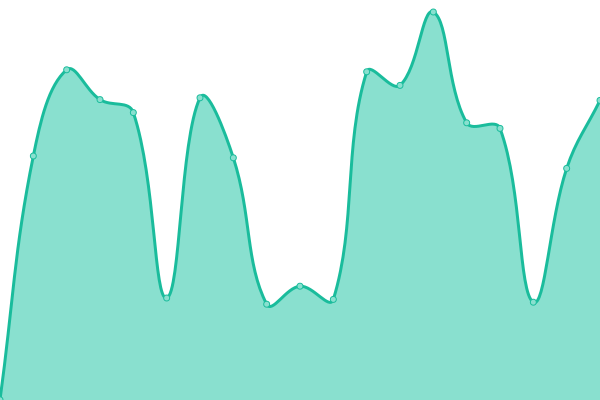
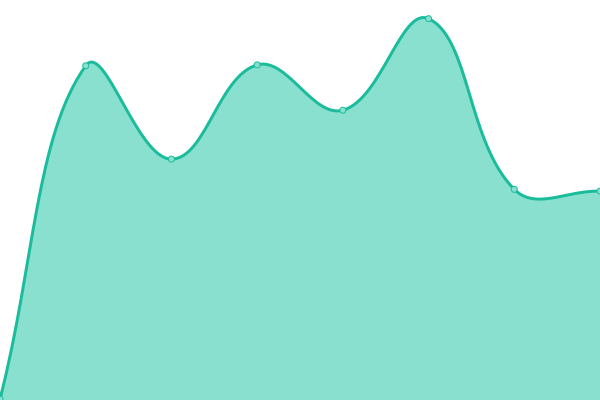

# [📈 Live Status](https://status.agenziabergamaschi.com): <!--live status--> **🟧 Partial outage**

This repository contains the open-source uptime monitor and status page for [Agenzia Bergamaschi Real Estate](https://agenziabergamaschi.com), powered by [Upptime](https://github.com/upptime/upptime).

With [Upptime](https://upptime.js.org), you can get your own unlimited and free uptime monitor and status page, powered entirely by a GitHub repository. We use [Issues](https://github.com/agenziabergamaschi/status/issues) as incident reports, [Actions](https://github.com/agenziabergamaschi/status/actions) as uptime monitors, and [Pages](https://status.agenziabergamaschi.com) for the status page.

<!--start: status pages-->
<!-- This summary is generated by Upptime (https://github.com/upptime/upptime) -->
<!-- Do not edit this manually, your changes will be overwritten -->
<!-- prettier-ignore -->
| URL | Status | History | Response Time | Uptime |
| --- | ------ | ------- | ------------- | ------ |
|  [Agenzia Bergamaschi Real Estate](https://agenziabergamaschi.com) | 🟥 Down | [agenzia-bergamaschi-real-estate.yml](https://github.com/agenziabergamaschi/status/commits/HEAD/history/agenzia-bergamaschi-real-estate.yml) | 

 672ms
     
 | 

<a href="https://status.agenziabergamaschi.com/history/agenzia-bergamaschi-real-estate">83.56%</a>
    

|  Agenzia Bergamaschi Real Estate (test) | 🟥 Down | [agenzia-bergamaschi-real-estate-test.yml](https://github.com/agenziabergamaschi/status/commits/HEAD/history/agenzia-bergamaschi-real-estate-test.yml) | 

 660ms
     
 | 

<a href="https://status.agenziabergamaschi.com/history/agenzia-bergamaschi-real-estate-test">83.65%</a>
    

|  [Spazio Tricolore](https://spaziotricolore.it) | 🟥 Down | [spazio-tricolore.yml](https://github.com/agenziabergamaschi/status/commits/HEAD/history/spazio-tricolore.yml) | 

 977ms
     
 | 

<a href="https://status.agenziabergamaschi.com/history/spazio-tricolore">83.74%</a>
    

|  Spazio Tricolore (test) | 🟥 Down | [spazio-tricolore-test.yml](https://github.com/agenziabergamaschi/status/commits/HEAD/history/spazio-tricolore-test.yml) | 

 972ms
     
 | 

<a href="https://status.agenziabergamaschi.com/history/spazio-tricolore-test">83.83%</a>
    

|  [Spazio Tricolore (backend)](https://api.agenziabergamaschi.com/spaziotricolore/) | 🟥 Down | [spazio-tricolore-backend.yml](https://github.com/agenziabergamaschi/status/commits/HEAD/history/spazio-tricolore-backend.yml) | 

 1436ms
     
 | 

<a href="https://status.agenziabergamaschi.com/history/spazio-tricolore-backend">83.93%</a>
    

|  [Monitoraggio (questo sito web)](https://status.agenziabergamaschi.com) | 🟩 Up | [monitoraggio-questo-sito-web.yml](https://github.com/agenziabergamaschi/status/commits/HEAD/history/monitoraggio-questo-sito-web.yml) | 

 298ms
     
 | 

<a href="https://status.agenziabergamaschi.com/history/monitoraggio-questo-sito-web">100.00%</a>
    

<!--end: status pages-->

[**Visit our status website →**](https://status.agenziabergamaschi.com)

## 📄 License

- Powered by: [Upptime](https://github.com/upptime/upptime)
- Code: [MIT](./LICENSE) © [Anand Chowdhary](https://anandchowdhary.com), supported by [Pabio](https://pabio.com)
- Data in the `./history` directory: [Open Database License](https://opendatacommons.org/licenses/odbl/1-0/)
